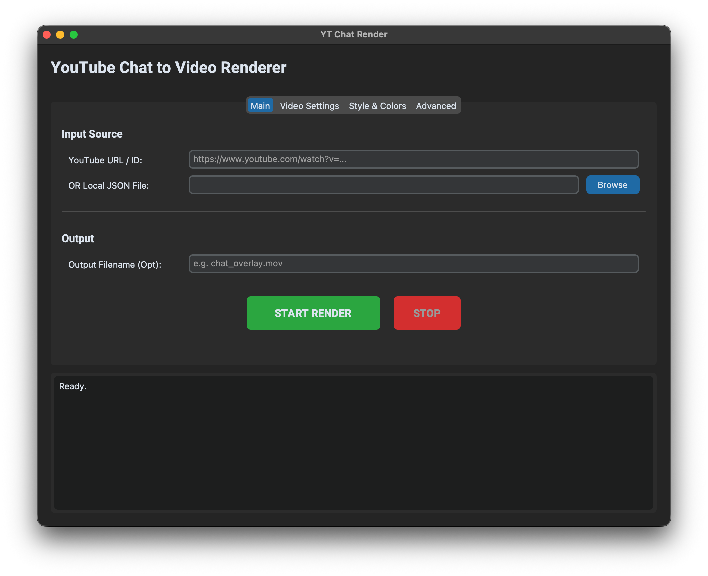

# YT Chat Render

This is an enhanced version of the original script that converts YouTube Live Chat JSON or direct YouTube Video IDs into a high-quality video overlay. It supports advanced features like role-based coloring, hardware-accelerated ProRes 4444 (with transparency), and direct integration with `yt-dlp`.

<br/>
<div align="center">
   
</div>
<br/>

## 🚀 New: Full GUI App
A user-friendly Graphical User Interface is now available!
- **Download**: Check the [Releases](https://github.com/8wapnil/yt-chat-to-video/releases) page for the latest Mac `.app` or Windows `.exe`.
- **Run Source**: `python gui.py`

## Key Enhancements

- **Direct YouTube Input**: Render chat directly by providing a YouTube URL or ID.
- **Advanced Coloring**: Customize colors for Owners, Moderators, Members, and Normal users separately.
- **Professional Export**: Export in ProRes 4444 with alpha (transparency) using hardware acceleration on macOS.
- **Improved Performance**: Better frame rendering and higher default framerates (60fps support).

## Requirements

- Python 3.6+
- [ffmpeg](https://ffmpeg.org/download.html)
- [yt-dlp](https://github.com/yt-dlp/yt-dlp) (optional, for direct video ID support)
- Python packages:
    ```bash
    pip install Pillow requests
    ```

## Usage

### 1. Direct YouTube ID/URL
You can now skip the manual `yt-dlp` step. Just provide the video URL:
```bash
python yt-chat-to-video.py "https://www.youtube.com/watch?v=VIDEO_ID" --output overlay.mov --codec prores --transparent --hwaccel
```

### 2. Manual JSON File
If you already have a `.live_chat.json` file:
```bash
python yt-chat-to-video.py your_file.live_chat.json
```

## Professional Export Examples

### Transparent ProRes 4444 (Best for Mac/Premiere/Final Cut)
Uses hardware acceleration (`prores_videotoolbox`) for professional-grade transparent overlays.
```bash
python yt-chat-to-video.py VIDEO_ID --codec prores --transparent --hwaccel
```

### High Efficiency HEVC (H.265)
```bash
python yt-chat-to-video.py VIDEO_ID --codec hevc --hwaccel
```

## Advanced Coloring

| Role | Argument | Default |
| :--- | :--- | :--- |
| **Owner** | `--color-owner` | `#ffd600` (Yellow) |
| **Moderator** | `--color-moderator` | `#5e84f1` (Blue) |
| **Member** | `--color-member` | `#2ba640` (Green) |
| **Normal** | `--color-normal` | `#ffffff` (White) |

**Example:**
```bash
python yt-chat-to-video.py input.json --color-moderator "#ff0000" --outline-width 2
```

## Command Line Arguments

| Option               | Description                                                           | Default   |
|----------------------|-----------------------------------------------------------------------|-----------|
| `input_source`       | JSON file OR YouTube URL/ID                                           | `required`|
| `-o`, `--output`     | Output video file name                                                | `auto`    |
| `-w`, `--width`      | Output video width                                                    | `400`     |
| `-h`, `--height`     | Output video height                                                   | `540`     |
| `-r`, `--frame-rate` | Output video framerate                                                | `60`      |
| `--codec`            | Video codec (`h264`, `hevc`, `prores`, `av1`)                         | `h264`    |
| `--hwaccel`          | Use hardware acceleration (e.g., VideoToolbox on Mac)                 | `false`   |
| `--transparent`      | Make chat background transparent                                      | `false`   |
| `--outline-width`    | Thickness of the text border                                          | `1`       |
| `--outline-color`    | Color of the text border                                              | `#000000` |
| `--use-cache`        | Cache downloaded avatars and emojis to disk                           | `false`   |

## Fonts

This project includes the [Roboto](https://fonts.google.com/specimen/Roboto) font, licensed under the [Apache License, Version 2.0](https://www.apache.org/licenses/LICENSE-2.0).

Copyright (c) Google Fonts
